# Hyperventilation Syndrome - Architecture Overview

## Medical Knowledge Architecture

This diagram presents a comprehensive overview of hyperventilation syndromes, organized by medical domains and their relationships.

```mermaid
graph TD
    %% Definición de estilos inspirados en los colores de las categorías del PDF original
    classDef main fill:#0284c7,stroke:#0369a1,stroke-width:3px,color:#fff,font-weight:bold,font-size:18px;
    classDef catDef fill:#34d399,stroke:#047857,stroke-width:2px,color:#000,font-weight:bold;
    classDef catEtio fill:#fde047,stroke:#a16207,stroke-width:2px,color:#000,font-weight:bold;
    classDef catEpi fill:#cbd5e1,stroke:#475569,stroke-width:2px,color:#000,font-weight:bold;
    classDef catFisio fill:#93c5fd,stroke:#1d4ed8,stroke-width:2px,color:#000,font-weight:bold;
    classDef catClin fill:#f9a8d4,stroke:#be185d,stroke-width:2px,color:#000,font-weight:bold;
    classDef catDiag fill:#fcd34d,stroke:#b45309,stroke-width:2px,color:#000,font-weight:bold;
    classDef catTx fill:#bbf7d0,stroke:#15803d,stroke-width:2px,color:#000,font-weight:bold;
    classDef textNode fill:#ffffff,stroke:#9ca3af,stroke-width:1px,color:#333;

    %% NODO CENTRAL
    ROOT["SÍNDROMES DE HIPERVENTILACIÓN"]:::main

    %% RAMAS PRINCIPALES SUPERIORES
    ROOT --> DEF["DEFINICIÓN"]:::catDef
    ROOT --> ETIO["ETIOLOGÍA"]:::catEtio
    ROOT --> EPI["EPIDEMIOLOGÍA"]:::catEpi

    %% Contenido Definición
    DEF --> DEF_T["PaCO2 &lt; 35 mmHg.<br/>La ventilación excede las necesidades metabólicas.<br/>*Síndrome = forma crónica, frecuentemente de origen psicógeno/ansioso."]:::textNode

    %% Contenido Etiología
    ETIO --> ET_1["Hipoxemia (cualquier origen)"]:::textNode
    ETIO --> ET_2["Metabólicas (acidosis diabética/láctica, IRC, IH)"]:::textNode
    ETIO --> ET_3["Neurológicas / Psicógenas (ansiedad, tumores, infecciones SNC)"]:::textNode
    ETIO --> ET_4["Fármacos, sepsis, fiebre, dolor, embarazo"]:::textNode

    %% Contenido Epidemiología
    EPI --> EPI_T["Afecta hasta 10% de población adulta (mujeres jóvenes, asmáticos).<br/><b>Ecuador:</b> Alto subdiagnóstico por confusión con ansiedad.<br/>*Obligado descartar primero causas orgánicas graves (TEP, sepsis)."]:::textNode

    %% RAMA CENTRAL: FISIOPATOLOGÍA
    ROOT --> FISIO["FISIOPATOLOGÍA"]:::catFisio
    FISIO --> F_1["Aumento del impulso respiratorio central<br/>↓<br/>↑ Esfuerzo muscular y volumen minuto"]:::textNode
    F_1 --> F_2["Disminución PaCO2 (Hipocapnia)<br/>↓<br/><b>ALCALOSIS RESPIRATORIA</b>"]:::textNode
    F_2 --> F_3["Vasoconstricción cerebral"]:::textNode
    F_2 --> F_4["↓ Calcio libre en suero<br/>Hipofosfatemia asociada"]:::textNode

    %% RAMA: CUADRO CLÍNICO
    ROOT --> CLIN["CUADRO CLÍNICO"]:::catClin
    
    %% Conexiones fisiopatología -> clínica
    F_3 -. "Provoca" .-> C_2
    F_4 -. "Provoca" .-> C_3

    CLIN --> C_1["<b>Disnea</b> (síntoma más frecuente, sin correlación con PaCO2)"]:::textNode
    CLIN --> C_2["<b>Neurológicos:</b> Mareo, síncope, convulsiones, trastornos visuales"]:::textNode
    CLIN --> C_3["<b>Por Hipocalcemia/Hipofosfatemia:</b> Parestesias, tetania,<br/>espasmo carpopedal, debilidad muscular"]:::textNode
    CLIN --> C_4["<b>Forma Psicógena:</b> Suspiros frecuentes, palpitaciones.<br/>Predomina en reposo y mejora con ejercicio suave."]:::textNode

    %% RAMAS INFERIORES: DIAGNÓSTICO Y EXÁMENES
    ROOT --> DIAG["DIAGNÓSTICO"]:::catDiag
    ROOT --> EXAM["EXÁMENES COMPLEMENTARIOS"]:::catDiag
    ROOT --> DDX["DIAGNÓSTICO DIFERENCIAL"]:::catDiag

    DIAG --> D_1["Historia clínica + Gasometría arterial<br/>Calcular <b>Gradiente D(A-a)O2</b>"]:::textNode
    D_1 --> D_2["<b>D(A-a)O2 Elevado:</b> Enfermedad Orgánica<br/>(ej. TEP, empeora con esfuerzo)"]:::textNode
    D_1 --> D_3["<b>D(A-a)O2 Normal:</b> Sospecha Psicógena<br/>(Mejora con ejercicio, PCO2 transcutánea normal en sueño)"]:::textNode

    EXAM --> EX_1["• Gasometría arterial y D(A-a)O2<br/>• ECG (descartar isquemia/arritmias)<br/>• Rx de Tórax / Angio-TC (descartar TEP)<br/>• Glucemia y perfil metabólico venoso<br/>• Valoración psiquiátrica (si se excluye organicidad)"]:::textNode

    DDX --> DDX_1["• Tromboembolismo pulmonar (agudo o crónico)<br/>• Causas metabólicas (cetoacidosis, IRC) / Sepsis<br/>• Crisis de pánico<br/>• Asma mal controlada"]:::textNode

    %% RAMAS INFERIORES: TRATAMIENTO Y PRONÓSTICO
    ROOT --> TX["TRATAMIENTO"]:::catTx
    ROOT --> PRON["PRONÓSTICO"]:::catTx

    TX --> T_1["<b>Enfermedad Orgánica:</b><br/>Tratar la causa subyacente (ej. anticoagulación en TEP)"]:::textNode
    TX --> T_2["<b>Crisis Aguda Psicógena:</b><br/>Inhalación baja de CO2 (bolsa de papel)<br/>Técnicas de control respiratorio"]:::textNode
    TX --> T_3["<b>Forma Crónica:</b><br/>Reeducación respiratoria, manejo de ansiedad, TCC / Ansiolíticos"]:::textNode

    PRON --> P_1["<b>Psicógena:</b> Excelente con reeducación, aunque tiende a la recurrencia."]:::textNode
    PRON --> P_2["<b>Secundaria:</b> Depende enteramente de la enfermedad de base (ej. grave en TEP masivo)."]:::textNode

    %% Configuración de enlaces
    linkStyle default stroke:#94a3b8,stroke-width:1.5px;
```

## Architecture Components

### Core Domains
- **Definition** (Green): Establishes diagnostic criteria and classification
- **Etiology** (Yellow): Identifies causative factors and underlying mechanisms
- **Epidemiology** (Gray): Population distribution and regional considerations

### Pathophysiology (Blue)
Central mechanism explaining how respiratory alkalosis develops and creates complications

### Clinical Presentation (Pink)
Symptoms and signs resulting from physiological changes, with direct links from pathophysiology

### Diagnosis & Assessment (Orange/Gold)
- Clinical approach using arterial blood gas and alveolar-arterial gradient (A-a gradient)
- Complementary examinations for differential diagnosis
- Differential diagnosis considerations

### Management (Green)
- Treatment approaches stratified by etiology (organic vs. psychogenic)
- Acute vs. chronic management strategies

### Prognosis
Outcome predictions based on underlying cause

## Key Clinical Insights

1. **PaCO2 < 35 mmHg** is the defining criterion
2. **A-a gradient** is crucial for distinguishing organic from psychogenic causes
3. **High index of suspicion** for organic causes (TEP, sepsis) before attributing to anxiety
4. **Regional note**: Ecuador has significant underdiagnosis due to confusion with anxiety disorders
5. **Symptom-lab mismatch**: Dyspnea severity doesn't correlate with PaCO2 levels

---

*Last Updated: 2026-09-11*
